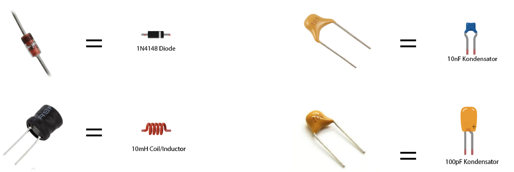

#### Guide til Advanced Sensing - Touché

Arduino og Processing kode er lavet af [Mads Hobye](https://www.instructables.com/id/Touche-for-Arduino-Advanced-touch-sensing/)

1. Start med at downloade repository

2. For at bygge setuppet kan i benytte følgende illustration. Nogle af komponenterne fra illustrationen er vist nederst i denne sektion.

Vær opmærksom på at de rigtige kondensatorer bliver brugt for at der kommer et optimalt frekvensaflæsning.

3. Når i har bygget setuppet kan i tilslutte arduinoen og uploade koden. I kan herefter forsøge at køre testkoden i processing og se om der er udsving. Grafen skulle gerne så således ud:

[Indsæt billede]

Herefter kan i tage ledningen der fører til objektet og sætte på fx en plante, frugt eller i en kop med vand. Brug evt. Et krokkodillenæb.

Hvis I oplever en fejl med Serial i processingkoden kan gentilslutte arduinoen, vente et par sekunder, og køre sketchen igen.

Når i har fået processing koden til køre, kan i forsøge at 'træne' sketchen, ved at trykke på firkanterne ved de forskellige tilstande.

Eksempelvis
0 - ingen berørelse ved objektet
1 - en finger på objektet
2 - holder fast om objektet

Hvis I herefter vil bruge jeres gesture inputs i processing kan i benytte jer af filen der hedder Receive OSC. Koden benytter sig af open sound control protokollen til at sende dataen. I skriver jeres sketch i draw og bruger fx. currentState variablen.

I kan eksperimentere mere med koden da OSC er bredt supporteret i forskellige devices og kodemiljøere.
